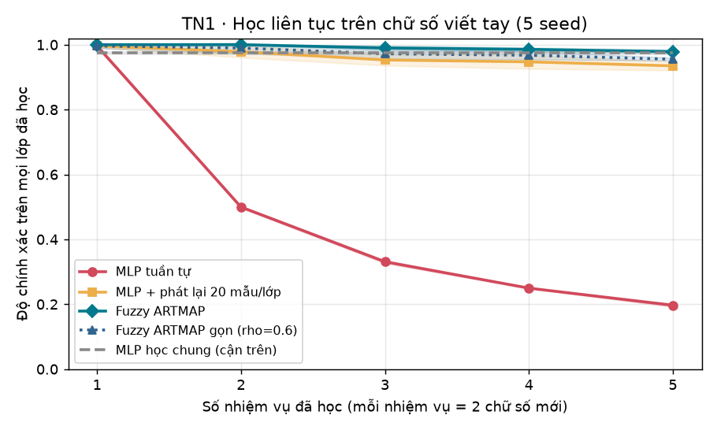
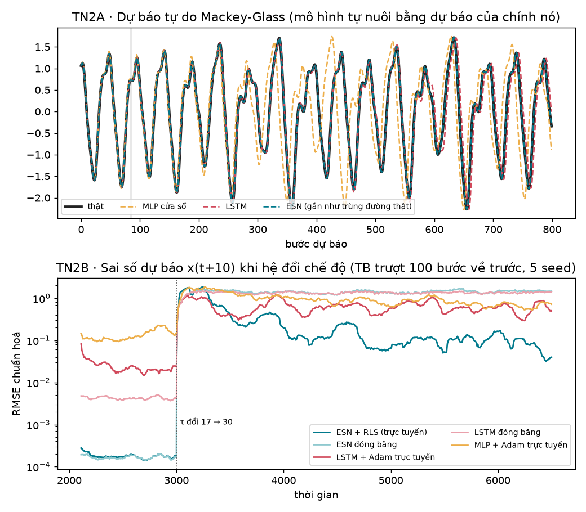
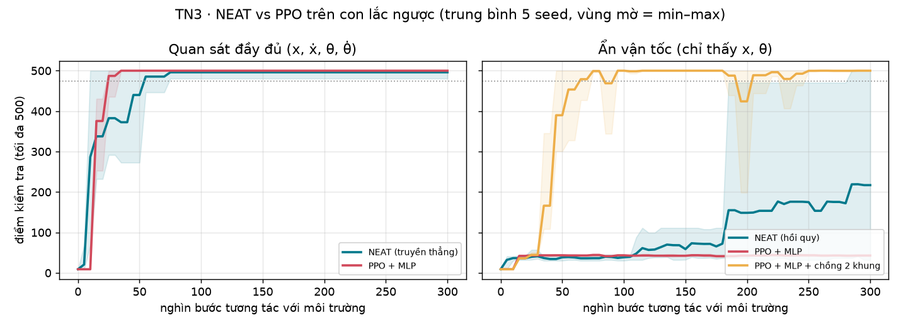
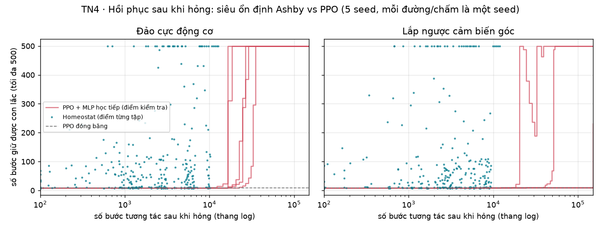
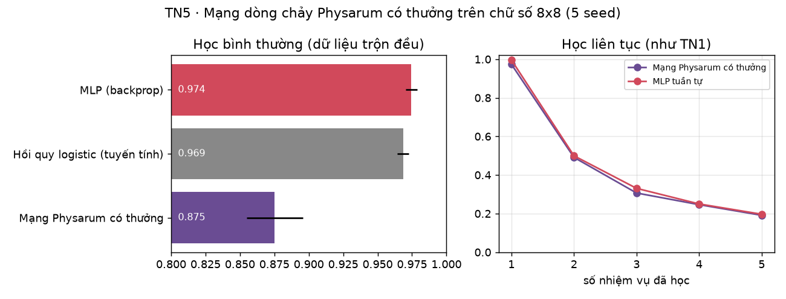
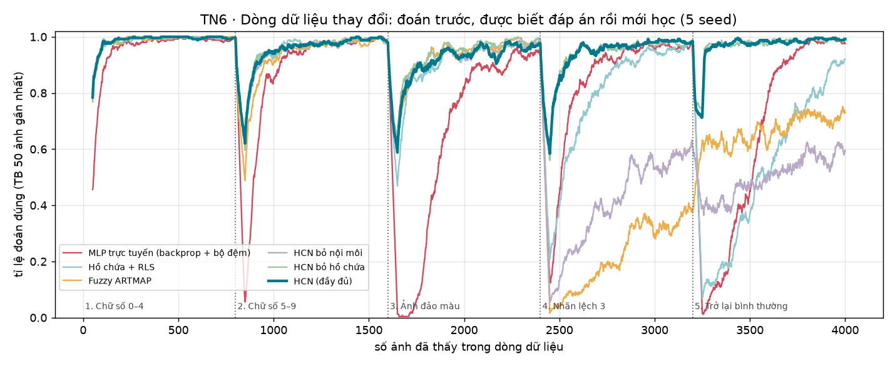

# Các mô hình thích nghi khác so với mạng nơ-ron

Mạng nơ-ron học bằng lan truyền ngược (backprop) chỉ là **một** cách để một hệ thích nghi.
Thư mục này dựng các mô hình thích nghi khác, mỗi mô hình được thử trên đúng loại bài toán
mà lý thuyết cho là **điểm mạnh** của nó, rồi so với mạng nơ-ron huấn luyện bằng backprop.

| # | Mô hình thích nghi | Nguồn gốc | Điểm mạnh được thử |
|---|---|---|---|
| 1 | Fuzzy ARTMAP | Lý thuyết cộng hưởng thích nghi (Grossberg, Carpenter) | Học liên tục mà không quên |
| 2 | Echo State Network + RLS | Tính toán hồ chứa, bộ lọc thích nghi | Chuỗi hỗn loạn, thích nghi trực tuyến khi hệ đổi chế độ |
| 3 | NEAT | Tiến hoá cấu trúc mạng (Stanley & Miikkulainen) | Không cần gradient, mạng tí hon, tự tiến hoá trí nhớ |
| 4 | Homeostat siêu ổn định | Điều khiển học (Ashby, *Design for a Brain*) | Tự hồi phục khi hệ bị hỏng, không cần mục tiêu hay mô hình |
| 5 | Mạng dòng chảy Physarum có thưởng | Nấm nhầy (Tero et al.) + luật 3 yếu tố | Ý tưởng mới, thử xem có dùng được không |
| 6 | **Mạng lai HCN** (Hồ chứa – Cộng hưởng – Nội môi) | Ghép 1 + 2 + 4 | Dòng dữ liệu thay đổi liên tục |

## Các bài toán này thực chất là gì? (đọc phần này trước)

Mỗi thí nghiệm là một "kỳ thi" giữa hai thí sinh: **mô hình thích nghi khác** và **mạng nơ-ron học bằng
backprop** (loại đang dùng trong gần như mọi AI hiện nay). Đề thi được chọn đúng vào loại tình huống
mà mạng nơ-ron *thường* gặp khó khi triển khai thật: thế giới thay đổi sau khi đã học xong.

| TN | Đề thi, nói bằng lời thường | Tình huống ngoài đời giống thế này | Đo cái gì |
|---|---|---|---|
| 1 | Dạy nhận chữ số viết tay theo từng đợt: đợt 1 chỉ dạy chữ 0 và 1, đợt 2 chỉ dạy 2 và 3… Học đợt sau thì **không được xem lại** ảnh của đợt trước. Cuối cùng thi cả 10 chữ số. | Camera nhà máy được dạy thêm loại lỗi mới mỗi tháng; không lưu được dữ liệu cũ (dung lượng, quyền riêng tư). | % đoán đúng trên cả 10 chữ số: có **quên** cái cũ không? |
| 2A | Cho xem một đường tín hiệu hỗn loạn (giống nhịp tim, thời tiết, dao động máy móc), rồi bắt **tự vẽ tiếp** càng xa càng tốt, không được nhìn đáp án. | Dự báo phụ tải điện, dao động cơ khí, chuỗi sinh học. | Vẽ đúng được bao nhiêu bước; mất bao lâu để học. |
| 2B | Giữa chừng, "luật" sinh ra tín hiệu đột ngột đổi. Mô hình vừa dự báo vừa tự sửa. | Máy móc bị mòn, thị trường đổi pha, cảm biến trôi. | Sai số trước, ngay sau và lâu sau khi đổi. |
| 3 | Giữ một cây gậy dựng đứng trên chiếc xe đẩy (chỉ được đẩy trái/phải). Phiên bản khó: **không được biết vận tốc**, chỉ thấy vị trí. | Robot giữ thăng bằng, điều khiển drone. | Có giữ được 500 bước không; cần thử bao nhiêu lần; mạng to cỡ nào. |
| 4 | Như TN3, nhưng đang giữ tốt thì **hỏng**: động cơ bị nối ngược dây, hoặc cảm biến góc bị lắp ngược. | Robot bị va đập, thiết bị bị lắp sai khi bảo trì. | Mất bao lâu để tự giữ lại được gậy. |
| 5 | Nhận chữ số viết tay bình thường (dữ liệu trộn đều, học bao nhiêu lượt cũng được). | Bài phân loại "sách giáo khoa". | % đoán đúng. Đây là sân nhà của mạng nơ-ron. |
| 6 | Một **dòng** ảnh chữ số liên tục thay đổi (chi tiết ở TN6). Mỗi ảnh: đoán trước, rồi mới được biết đáp án. | Hệ thống chạy thật, luôn học trong lúc làm việc. | % đoán đúng suốt dòng dữ liệu. |

"Mạng nơ-ron" trong các thí nghiệm là: **MLP** (mạng nhiều lớp thông thường) ở TN1, TN5, TN6; **LSTM**
(mạng có trí nhớ, chuẩn cho chuỗi thời gian) ở TN2; **PPO** (thuật toán học tăng cường phổ biến nhất,
dùng MLP) ở TN3, TN4. Tất cả học bằng backprop + Adam, là cách huấn luyện chuẩn hiện nay.

## Cách làm để so sánh công bằng

- **5 seed** cho mọi thí nghiệm, báo cáo *trung bình ± độ lệch chuẩn*.
- Siêu tham số chọn trên tập/đoạn kiểm định, **không nhìn tập test**: ARTMAP, Physarum và cả ba mô hình
  ở TN2 (ESN, LSTM, MLP) được dò lưới. MLP ở TN1/TN5, PPO và NEAT dùng cấu hình chuẩn phổ biến.
- Baseline mạng nơ-ron là loại mạnh, phổ biến: MLP và LSTM huấn luyện bằng Adam, PPO (có thưởng entropy như cấu hình CleanRL).
- Cùng dữ liệu, cùng ngân sách tương tác.
- Hạn chế: môi trường chạy không tải được MNIST nên dùng bộ chữ số 8×8 của scikit-learn (1.797 ảnh);
  mọi thứ chạy trên CPU; con lắc ngược là bài điều khiển đơn giản.

## Tóm tắt kết quả

| TN | Bài toán (điểm mạnh được thử) | Mô hình thích nghi | Mạng nơ-ron backprop tốt nhất | Kết luận |
|---|---|---|---|---|
| 1 | Học 5 nhiệm vụ liên tiếp, không xem lại dữ liệu cũ | ARTMAP **97,9%** | MLP 19,7% (93,5% nếu cho phát lại dữ liệu cũ) | ✅ **Thắng rõ** |
| 2A | Dự báo tự do chuỗi hỗn loạn | ESN đúng **~1.000 bước**, học trong 1,3 s | LSTM đúng ~585 bước, học trong 208 s | ✅ **Thắng rõ** |
| 2B | Hệ đổi chế độ giữa chừng | ESN + RLS: sai số dài hạn **0,13** | LSTM học trực tuyến: 0,70, nhưng bắt kịp nhanh hơn ngay sau khi đổi | ✅ **Thắng**, có đánh đổi |
| 3 | Con lắc ngược, không dùng gradient | NEAT: mạng **5 tham số**, chạy 4 s | PPO: 9.155 tham số, 46 s, nhưng cần ít bước hơn và ổn định hơn | ➖ **Hoà**: gọn hơn nhưng kém tin cậy |
| 4 | Tự hồi phục khi hệ bị hỏng | Homeostat: hồi phục 5/5, **~6–7 nghìn bước** | PPO học tiếp: 5/5 và 2/5, 25–36 nghìn bước; đóng băng: 0/5 | ✅ **Thắng** (mới thử với bộ điều khiển nhỏ) |
| 5 | Phân loại chữ số (ý tưởng mới) | Physarum: 87,5% | MLP 97,4% | ❌ **Thua** |
| 6 | Dòng dữ liệu đổi 4 lần (5 pha) | **Mạng lai HCN: 94,8%** | MLP trực tuyến 78,9% | ✅ **Thắng rõ** |

---

## TN1 · Học liên tục: Fuzzy ARTMAP vs MLP

`tn1_hoc_lien_tuc.py` · Chữ số 8×8, 10 lớp chia thành 5 nhiệm vụ (mỗi nhiệm vụ 2 chữ số), học lần lượt,
**không được xem lại dữ liệu cũ**. Đo độ chính xác trên mọi lớp đã học.



| Mô hình | Độ chính xác cuối (10 lớp) | Tham số / số nhớ | Thời gian học |
|---|---|---|---|
| MLP tuần tự (backprop) | **19,7% ± 0,5** | 9.610 | 1,5 s |
| MLP + phát lại 20 mẫu/lớp | 93,5% ± 1,4 | 9.610 (+ bộ nhớ 200 ảnh) | 1,5 s |
| **Fuzzy ARTMAP** (ρ = 0,85, 1 lượt duyệt) | **97,9% ± 0,6** | 69.120 (531 nút loại) | 0,11 s |
| Fuzzy ARTMAP gọn (ρ = 0,6) | 95,5% ± 0,4 | 16.768 (126 nút loại) | 0,03 s |
| *Tham chiếu:* MLP học chung toàn bộ dữ liệu (không phải học liên tục) | 97,4% ± 0,4 | 9.610 | 0,6 s |
| *Tham chiếu:* 1-láng-giềng-gần-nhất (nhớ hết 1.257 ảnh) | 98,6% ± 0,3 | 80.448 | ~0 |

**Đọc kết quả**
- MLP học tuần tự quên gần như sạch: chỉ còn nhận ra 2 chữ số cuối cùng (≈ 20%). Đây là
  *catastrophic forgetting* kinh điển.
- ARTMAP học từng mẫu **một lần duyệt**, không cần phát lại dữ liệu cũ, mà vẫn ngang MLP học
  chung toàn bộ dữ liệu. Nguyên nhân: mỗi lần học chỉ sửa đúng một nút thắng cuộc, và khi đầu vào
  lạ quá (dưới ngưỡng cảnh giác ρ) thì **mọc nút mới** thay vì ghi đè nút cũ.
- Cái giá phải trả: ARTMAP phình to (531 nút ≈ 7× số tham số của MLP). Hạ ρ xuống 0,6 thì mạng gọn
  hơn (126 nút) nhưng mất khoảng 2 điểm. Trên bộ dữ liệu nhỏ và dễ này, cách "nhớ hết" (1-NN) còn
  thắng cả hai, nên lợi thế thật của ARTMAP so với 1-NN là **nén** dữ liệu (126–531 nút so với 1.257 ảnh).

## TN2 · Chuỗi hỗn loạn: Echo State Network vs LSTM & MLP

`tn2_chuoi_hon_loan.py` · Chuỗi Mackey-Glass (phương trình vi phân có trễ, hỗn loạn khi τ = 17).
Echo State Network gồm 500 nơ-ron nối ngẫu nhiên và **giữ cố định**; chỉ lớp đọc ra (502 số) được học,
bằng hồi quy tuyến tính. Baseline: LSTM 128 nơ-ron và MLP nhìn cửa sổ 20 giá trị gần nhất, cả hai
học bằng backprop + Adam.



**A. Dự báo tự do** (khởi động bằng dữ liệu thật, rồi mô hình tự nuôi bằng dự báo của chính nó;
30 điểm xuất phát × 5 seed). "Thời gian dự báo đúng" = số bước cho đến khi sai số vượt 0,3 độ lệch chuẩn.

| Mô hình | Thời gian dự báo đúng | Sai số ở bước 84 (NRMSE) | Thời gian huấn luyện | Tham số được học |
|---|---|---|---|---|
| **ESN** | **1.003 ± 101 bước** | **0,0007** | **1,3 s** | 502 |
| LSTM (backprop qua thời gian) | 585 ± 65 bước | 0,0087 | 208 s | 66.689 |
| MLP cửa sổ | 149 ± 70 bước | 0,24 | 2,5 s | 19.329 |

**B. Hệ đổi chế độ giữa chừng**: sau 1.000 bước trực tuyến, τ nhảy từ 17 lên 30 (động lực học khác hẳn).
Mô hình dự báo trước 10 bước và được cập nhật từng bước khi nhãn thật tới. ESN dùng **RLS** (bộ lọc
thích nghi kinh điển, hệ số quên 0,995); LSTM và MLP làm một bước Adam mỗi thời điểm trên dữ liệu gần nhất.

| Mô hình | NRMSE trước khi đổi | 500 bước ngay sau khi đổi | Từ 1.500 bước sau trở đi | Thời gian xử lý trực tuyến |
|---|---|---|---|---|
| **ESN + RLS** | **0,0002** | 1,29 ± 0,31 | **0,13 ± 0,02** | 4,3 s |
| ESN đóng băng | 0,0002 | 1,51 ± 0,24 | 1,46 ± 0,20 | – |
| LSTM + Adam trực tuyến | 0,023 | **0,87 ± 0,05** | 0,70 ± 0,09 | 91 s |
| LSTM đóng băng | 0,004 | 1,39 ± 0,05 | 1,36 ± 0,02 | – |
| MLP + Adam trực tuyến | 0,18 | 1,63 ± 0,19 | 0,85 ± 0,04 | 3,0 s |

**Đọc kết quả**
- Dự báo tự do: ESN đoán đúng **lâu gấp ~1,7 lần** LSTM, và huấn luyện **nhanh hơn ~160 lần**, vì chỉ
  giải một hệ phương trình tuyến tính thay cho hàng nghìn bước gradient qua thời gian.
- Khi hệ đổi chế độ, cả hai mô hình đóng băng đều hỏng như nhau (NRMSE ≈ 1,4). Có một sự **đánh đổi**:
  - *Ngay sau* khi đổi, LSTM học trực tuyến bắt kịp nhanh hơn (0,87 so với 1,29): RLS cần vài trăm bước
    và bị dao động lúc đầu.
  - *Về lâu dài*, ESN + RLS chính xác hơn **~5 lần** (0,13 so với 0,70) với **1/20 lượng tính toán**.
  - Trước khi đổi, việc liên tục cập nhật bằng Adam còn làm LSTM kém đi khoảng 5 lần so với để nguyên.
- Lưu ý: hệ số quên của RLS và tốc độ học trực tuyến của LSTM chưa được tinh chỉnh riêng cho tình huống
  đổi chế độ. Hồ chứa cũng không được chỉnh lại cho τ = 30.

## TN3 · Tiến hoá (NEAT) vs PPO trên con lắc ngược

`tn3_tien_hoa.py` · Con lắc ngược CartPole (cùng phương trình với Gymnasium CartPole-v1, tối đa 500 bước).
Ngân sách 300.000 bước tương tác cho mỗi phương pháp. "Đạt" = điểm kiểm tra trung bình 20 tập ≥ 475.



| Bài | Phương pháp | Điểm cuối (100 tập) | Số seed đạt | Bước đến khi đạt | Tham số | Thời gian |
|---|---|---|---|---|---|---|
| Quan sát đầy đủ | NEAT | 499,2 ± 1,6 | 5/5 | 39.900 ± 23.100 | **5** | **4 s** |
| Quan sát đầy đủ | PPO + MLP | 500,0 ± 0 | 5/5 | **22.500 ± 4.100** | 9.155 | 46 s |
| Ẩn vận tốc | NEAT (được phép có kết nối hồi quy) | 219,5 ± 212,4 | 1/5 | 280.800 | 5,8 | 4 s |
| Ẩn vận tốc | PPO + MLP | 42,9 ± 1,3 | 0/5 | – | 8.899 | 39 s |
| Ẩn vận tốc | PPO + MLP + chồng 2 khung hình | **498,1 ± 3,8** | **5/5** | 51.200 ± 11.200 | 9.155 | 41 s |
| Ẩn vận tốc | *Phụ:* NEAT với 1 triệu bước | 307,0 ± 221,8 | 3/5 | 550.300 ± 206.900 | 8,8 | 13 s |

**Đọc kết quả**
- Quan sát đầy đủ: cả hai đều giải được. PPO tốn **ít bước tương tác hơn**, còn NEAT cho lời giải
  **nhỏ hơn ~1.800 lần** (4 kết nối + 1 bias) và **nhanh hơn ~10 lần** theo đồng hồ, vì không phải tính gradient.
  (Thật ra bài này dễ đến mức chỉ cần thử ngẫu nhiên ~100 mạng tuyến tính là đã có cái giữ được 500 bước.)
- Ẩn vận tốc: MLP không có trí nhớ thì chịu, đúng như dự đoán. NEAT **tự tiến hoá** được kết nối hồi quy
  để ước lượng vận tốc (chỉ 1–2 nút ẩn, 7–8 tham số), không cần lan truyền ngược qua thời gian, nhưng **không ổn định**:
  1/5 seed trong 300k bước, 3/5 seed trong 1 triệu bước. PPO chỉ cần *người thiết kế* đưa sẵn trí nhớ
  (chồng 2 khung hình) là giải cả 5/5.
- Kết luận: tiến hoá thắng về độ gọn và tốc độ tính toán, **thua** về hiệu quả mẫu và độ tin cậy.

## TN4 · Siêu ổn định kiểu Ashby vs mạng nơ-ron khi hệ bị hỏng

`tn4_can_bang_noi_moi.py` · Mô hình của Ashby không có hàm mục tiêu, chỉ có **vùng sống được**
(con lắc chưa ngã, xe chưa chạm tường). Bộ điều khiển là một nơ-ron ngưỡng 4 trọng số. Mỗi khi hệ
văng ra khỏi vùng sống được, "bộ chọn nấc" nhảy các trọng số sang giá trị **ngẫu nhiên** mới; còn sống
được thì giữ nguyên. Không gradient, không mô hình, không phần thưởng.

Kịch bản: cả hai bộ điều khiển đã giữ được con lắc, rồi hệ **bị hỏng đột ngột** (giống thí nghiệm
đảo dây nối nổi tiếng của Ashby). "Hồi phục" với homeostat = 5 tập liên tiếp đủ 500 bước; với PPO =
điểm kiểm tra ≥ 475, đo mỗi 2.048 bước (các bước kiểm tra không bị tính, nên cách đo này có lợi cho PPO).
Ngân sách sau hỏng: 150.000 bước.



| | Homeostat (Ashby) | PPO + MLP học tiếp | PPO + MLP đóng băng |
|---|---|---|---|
| Học từ đầu trên hệ lành: số bước | **4.000 ± 1.100** | 22.500 ± 4.100 | – |
| Học từ đầu: điểm kiểm tra | 452 ± 58 | **500 ± 0** | – |
| **Đảo cực động cơ**: số seed hồi phục | 5/5 | 5/5 | 0/5 (điểm 8,8) |
| Đảo cực động cơ: số bước đến hồi phục | **6.900 ± 3.600** | 25.000 ± 6.800 | – |
| **Lắp ngược cảm biến góc**: số seed hồi phục | **5/5** | 2/5 | 0/5 (điểm 8,8) |
| Lắp ngược cảm biến góc: số bước đến hồi phục | **5.900 ± 3.300** | 35.800 ± 15.400 (2 seed) | – |
| Điểm sau cùng (100 tập, cảm biến ngược) | **489 ± 22** | 252 ± 220 | 8,8 |

**Đọc kết quả**
- Mạng nơ-ron đóng băng (cách triển khai phổ biến nhất) sụp hoàn toàn khi hệ hỏng.
- Homeostat hồi phục **nhanh hơn 3,5–6 lần** và **5/5 lần**, dù không biết mình bị hỏng gì, chỉ biết
  "mình đang không sống được".
- Điều bất ngờ: PPO học tiếp sau khi lắp ngược cảm biến bị **kẹt ở 3/5 seed** suốt 150.000 bước, trong khi
  học từ đầu chỉ tốn 22.500 bước. Đây là hiện tượng **mất tính dẻo** (*loss of plasticity*, Dohare et al.,
  *Nature* 2024): mạng đã học xong thì khó học lại hơn một mạng mới tinh.
- Điểm yếu của homeostat: nó dừng tìm ngay khi "sống được", chứ không tối ưu (điểm 452 so với 500).
  Quan trọng hơn, nhảy ngẫu nhiên chỉ khả thi vì bộ điều khiển có **4 trọng số**. Với một mạng lớn,
  tìm kiếm ngẫu nhiên sẽ vô vọng. **Mở rộng quy mô** là bài toán còn bỏ ngỏ của hướng này.

## TN5 · Ý tưởng mới: mạng dòng chảy Physarum có thưởng

`tn5_physarum.py` · Mỗi điểm ảnh bơm dòng chảy (độ sáng và phần bù), 10 lớp là 10 cống nối đất,
dòng chia theo định luật Kirchhoff. Luật học cục bộ `dD/dt = η·r·|Q| − λ·D`: ống dẫn tới cống đúng
thì dày lên, tới cống bị đoán sai thì mỏng đi, ống không dùng thì teo.



| Mô hình | Học bình thường | Học liên tục (giao thức TN1) |
|---|---|---|
| Mạng Physarum có thưởng | 87,5% ± 2,1 (còn 65% số ống) | 19,1% ± 0,5 |
| Hồi quy logistic (tuyến tính, gradient) | 96,9% ± 0,4 | – |
| MLP (backprop) | 97,4% ± 0,4 | 19,7% ± 0,5 |

**Đọc kết quả: ý tưởng này ở dạng đơn giản nhất thì thất bại.**
- Với độ dẫn cố định, mạng Kirchhoff là **tuyến tính** theo dòng bơm vào. Vì vậy sức chứa của nó
  không hơn hồi quy logistic, mà luật học cục bộ lại kém gradient khoảng 9 điểm.
- Nó cũng quên y như MLP, vì bản chất là **cạnh tranh dòng chảy**: ống tới lớp mới dày lên thì tự
  động giành dòng của lớp cũ.
- Muốn đi tiếp hướng này cần (a) phi tuyến, ví dụ độ dẫn thay đổi nhanh ngay trong lúc suy luận
  (μ > 1, kiểu "thắng làm vua"), và (b) cơ chế bảo vệ ống cũ, học theo ART.

## TN6 · Mạng lai HCN: Hồ chứa – Cộng hưởng – Nội môi

`tn6_mang_lai.py` · Ghép phần tinh tuý của ba mô hình đã thắng:

1. **Hồ chứa** (từ ESN): 512 nơ-ron ngẫu nhiên **cố định** biến ảnh thành đặc trưng. Không bao giờ học.
2. **Cộng hưởng** (từ ART): các nút mẫu. Học = chỉ kéo nút thắng cuộc lại gần ảnh; ảnh lạ quá thì
   **mọc nút mới**. Không gì bị ghi đè.
3. **Nội môi** (từ Ashby): theo dõi một "biến thiết yếu", là tỉ lệ đoán sai **ở những chữ số mình tưởng đã biết**.
   Đoán sai chữ số chưa từng học là chuyện bình thường (điều mới), không tính. Tỉ lệ này vượt 50% trong 20 lần
   gần nhất tức là "thế giới đã khác". Khi đó mạng **nhảy nấc**: thử các bộ nhớ ngữ cảnh đã cất trên 10 ảnh gần
   nhất, bộ nào đúng ≥ 50% thì dùng lại; không bộ nào được thì mở ngữ cảnh mới. Ngữ cảnh cũ **cất đi chứ không xoá**.

Không có backprop. Mỗi ảnh chỉ được xem một lần. Mạng tự mọc nút và tự mở ngữ cảnh khi cần.

**Dòng dữ liệu** (mỗi pha 800 ảnh, mỗi ảnh: đoán trước, rồi được biết đáp án rồi mới học):

| Pha | Chuyện gì xảy ra | Thử khả năng gì |
|---|---|---|
| 1 | Chỉ có chữ số 0–4 | Học nhanh |
| 2 | Chỉ có chữ số 5–9 | Học lớp mới mà không quên |
| 3 | Cả 10 chữ số, ảnh bị **đảo màu** | Cảm biến hỏng |
| 4 | Ảnh bình thường nhưng **nhãn lệch 3** (ảnh chữ 2 phải trả lời 5) | Luật đổi, kiến thức cũ thành sai |
| 5 | Mọi thứ **trở lại bình thường** | Còn nhớ cách cũ không? |



| Mô hình | Cả dòng | Pha 1 | Pha 2 | Pha 3 | Pha 4 | Pha 5 | 100 ảnh đầu pha 5 |
|---|---|---|---|---|---|---|---|
| MLP trực tuyến (backprop, bộ đệm 500 ảnh) | 78,9% | 94,3 | 86,6 | 64,6 | 83,9 | 65,3 | 5,4 |
| Hồ chứa + RLS | 83,2% | 98,0 | 94,7 | 90,1 | 79,5 | 53,5 | 9,6 |
| Fuzzy ARTMAP | 74,3% | 97,8 | 92,3 | 92,4 | 22,1 | 67,0 | 62,2 |
| HCN bỏ phần nội môi | 75,0% | 98,0 | 94,2 | 91,7 | 40,9 | 50,2 | 38,4 |
| HCN bỏ phần hồ chứa | **95,3%** | 98,0 | 94,9 | 93,6 | 93,4 | 96,7 | 85,6 |
| **HCN đầy đủ** | **94,8%** | 98,0 | 94,7 | 91,2 | 93,5 | 96,6 | 84,0 |

(5 seed, độ lệch chuẩn cả dòng ≤ 0,4 điểm. HCN đầy đủ dùng 514 nút và 2,8 ngữ cảnh; bỏ hồ chứa thì cần 796 nút.)

**Đọc kết quả**
- MLP chịu thiệt nhất ở mỗi lần thế giới đổi: gần như về 0% rồi phải học lại từ đầu, kể cả khi thế giới
  **quay về đúng như cũ** (pha 5 bắt đầu chỉ đúng 5%).
- ARTMAP không quên, nhưng **không bỏ được** kiến thức đã sai: ở pha 4 (nhãn lệch) các nút cũ cứ thắng
  với nhãn cũ, chỉ đúng 22%.
- HCN đầy đủ: khi nhãn lệch, sau khoảng 10–20 ảnh nó nhận ra "thế giới đã khác" và mở ngữ cảnh mới. Khi
  mọi thứ trở lại bình thường, nó **nhận ra ngữ cảnh cũ và dùng lại ngay**: 84% ngay trong 100 ảnh đầu,
  so với 5% của MLP.
- Thí nghiệm bỏ từng phần cho thấy **phần nội môi là mấu chốt** (bỏ đi thì còn 75%). Còn phần hồ chứa
  **không giúp tăng độ chính xác** ở bài ảnh tĩnh này; nó chỉ giúp mạng gọn hơn (514 so với 796 nút).
  Hồ chứa phát huy ở dữ liệu chuỗi thời gian (TN2); với ảnh tĩnh có thể bỏ.
- Lưu ý công bằng: bộ chữ số chỉ có ~1.800 ảnh nên dòng dữ liệu có ảnh lặp lại, điều này có lợi cho các mô
  hình "nhớ mẫu" như ART/HCN. Cơ chế nhảy nấc ở đây chọn ngữ cảnh tốt nhất chứ không nhảy ngẫu nhiên hoàn
  toàn như máy của Ashby. Chưa thử trên dữ liệu lớn.

---

## Kết luận

**Mô hình nào đáng đi tiếp?**

1. **ART** và **mạng hồ chứa** thắng rõ, có số liệu chắc, ở đúng bài toán của chúng. Hai hướng này đáng xây tiếp nhất.
2. **Homeostat** thắng về khả năng tự hồi phục, nhưng mới chỉ chứng minh được với bộ điều khiển 4 trọng số.
3. **NEAT** cho mạng tí hon và chạy nhanh, nhưng kém tin cậy. Nên dùng nó làm công cụ tìm kiến trúc hơn là làm luật học.
4. **Physarum** (ý tưởng của tôi) ở dạng đơn giản thì thua. Cần phi tuyến và cơ chế chống quên thì mới đáng thử lại.

**Điểm chung của những mô hình thắng**: không cái nào để một tín hiệu lỗi toàn cục sửa *toàn bộ* trọng số.
- ART chỉ sửa một nút, lạ quá thì mọc nút mới.
- Mạng hồ chứa giữ nguyên động lực học ngẫu nhiên, chỉ học lớp đọc ra tuyến tính.
- Homeostat chỉ thay đổi khi sự sống còn bị đe doạ.

Ngược lại, backprop thắng khi dữ liệu cố định, trộn đều và có hàm lỗi trơn (TN5, hiệu quả mẫu ở TN3).
Nó thua khi thế giới **thay đổi sau khi đã học xong**: bị quên (TN1), bị đóng băng hoặc mất tính dẻo (TN4).

**Mạng lai HCN (TN6)** ghép ba phần đã thắng và đạt 94,8% trên dòng dữ liệu thay đổi, so với 78,9%
của MLP học trực tuyến. Bước tiếp theo nên là thử HCN trên dữ liệu chuỗi thời gian thật (nơi phần hồ chứa
phát huy) và trên bộ dữ liệu lớn hơn.

## Chạy lại

```bash
pip install -r requirements.txt
python3 tn1_hoc_lien_tuc.py      # ~30 giây
python3 tn2_chuoi_hon_loan.py    # lâu nhất (~1 giờ trên CPU 4 nhân, chủ yếu do LSTM)
                                 # --chi-phan-B: giữ kết quả phần A, chỉ chạy lại phần B
                                 # --chi-ve-hinh: chỉ vẽ lại hình từ dữ liệu đã lưu
python3 tn3_tien_hoa.py          # ~10 phút
python3 tn4_can_bang_noi_moi.py  # ~10 phút
python3 tn5_physarum.py          # ~1 phút
python3 tn6_mang_lai.py          # ~5 phút
# hoặc: python3 chay_tat_ca.py
```

Kết quả số (JSON) và hình nằm trong `ketqua/`. Phiên bản thư viện đã dùng: numpy 2.4, scikit-learn 1.9,
jax 0.10, optax 0.2.8, neat-python 2.0.

| File | Nội dung |
|---|---|
| `chung.py` | MLP học bằng backprop (JAX + Adam), tiện ích lưu kết quả |
| `moi_truong.py` | Con lắc ngược + các kiểu "hỏng" (đảo cực động cơ, lắp ngược cảm biến góc) |
| `neat_config.ini` | Cấu hình NEAT |
| `tn1_…` → `tn5_…` | Năm thí nghiệm so sánh từng mô hình |
| `tn6_mang_lai.py` | Mạng lai HCN và dòng dữ liệu thay đổi |
